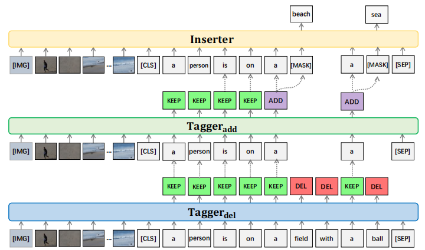

# TIger
This repository contains the reference code for the ECE model TIger proposed in the paper [Explicit Image Caption Editing](https://arxiv.org/abs/2207.09625) accpeted to ECCV 2022. Refer to our full paper for detailed intructions and analysis. The dataset and more detailed task information are available in this [ECE repository](https://github.com/baaaad/ECE).

Please cite with the following BibTeX:

```
@inproceedings{wang2022explicit,
  title={Explicit Image Caption Editing},
  author={Wang, Zhen and Chen, Long and Ma, Wenbo and Han, Guangxing and Niu, Yulei and Shao, Jian and Xiao, Jun},
  booktitle={Computer Vision--ECCV 2022: 17th European Conference, Tel Aviv, Israel, October 23--27, 2022, Proceedings, Part XXXVI},
  pages={113--129},
  year={2022}
}
```



## Environment setup
Clone the repository and create the `tiger` conda environment using the `conda.yml` file:
```
conda env create -f conda.yml
conda activate tiger
```

## Data preparation
### COCO_EE and Flickr30K_EE
The processed datasets have been placed in the [dataset](https://github.com/baaaad/TIger/tree/main/datasets) folder, they can also be directly download from [here](https://drive.google.com/drive/folders/1nzIsGT4SC81aMcC48tCMWcqL77sgYrvT?usp=sharing), including the COCO-EE and Flickr30K-EE in `train`, `eval` and `test` splits.

### Visual Features
For visual token features, we used the [bottom-up features](https://openaccess.thecvf.com/content_cvpr_2018/papers/Anderson_Bottom-Up_and_Top-Down_CVPR_2018_paper.pdf) (36 regions for each image) which are extracted by a pre-trained Faster R-CNN. 

**COCO-EE**

Download the pre-computed features file [trainval_36.zip](https://storage.googleapis.com/up-down-attention/trainval_36.zip) (~24.5 GB), unzip the file and rename the 'tsv' file as 'coco_36.tsv', then place it under the `datasets/bottom_up/COCO_36` folder, run the 'process_bottom_up_feature.py' to process the feature.
```
python process_bottom_up_feature.py
```

**Flickr30K-EE**

Download the pre-computed features file [flickr30k_36.zip](tbd) (~6.5 GB), unzip them and place 'flickr30k_36.tsv' under the `datasets/bottom_up/Flickr30K_36` folder, run the 'process_bottom_up_feature.py' to process the feature.
```
python process_bottom_up_feature.py
```

## Evaluation
To reproduce the results in the paper, download the pretrained model file [pretrained_tiger](https://drive.google.com/drive/folders/100QngSuBt_uM3RY2VZ4oLeTVjVx3RUT7?usp=share_link) (~6 GB) and place them under the `pretrained_models/COCOEE` and `pretrained_models/Flickr30KEE` folder, respectively.

To reproduce the results of our model, run:

**COCO-EE**

```
python eval.py --from_pretrained_tagger_del pretrained_models/COCOEE/tagger_del.bin --from_pretrained_tagger_add pretrained_models/COCOEE/tagger_add.bin --from_pretrained_inserter pretrained_models/COCOEE/inserter.bin --tasks 1 --batch_size 128 --save_name test_coco_ee --edit_round 5
```

**Flickr30K-EE**

```
python eval.py --from_pretrained_tagger_del pretrained_models/Flickr30KEE/tagger_del.bin --from_pretrained_tagger_add pretrained_models/Flickr30KEE/tagger_add.bin --from_pretrained_inserter pretrained_models/Flickr30KEE/inserter.bin --tasks 4 --batch_size 128 --save_name test_flickr30k_ee --edit_round 5
```

### Expected output
Under `results/`, you may find the edited results of all experiments. 

## Training procedure
Download the pretrained weights of [ViLBERT](https://arxiv.org/abs/1908.02265) from [here](https://drive.google.com/drive/folders/100QngSuBt_uM3RY2VZ4oLeTVjVx3RUT7?usp=share_link) (~1 GB) and place it under the `pretrained_models/ViLBERT-6-Layer` folder.

Run `python train.py` using the following arguments for different submodules.

### COCO-EE

**Tagger_del**

```
python train.py --tasks 1 --tagger_loss_ratio 1.5
```

**Tagger_add**

```
python train.py --tasks 2 --tagger_loss_ratio 1.5
```

**Inserter**

```
python train.py --tasks 3
```

### Flickr30K-EE

**Tagger_del**

```
python train.py --tasks 4 --tagger_loss_ratio 1.5
```

**Tagger_add**

```
python train.py --tasks 5 --tagger_loss_ratio 1.5
```

**Inserter**

```
python train.py --tasks 6
```

### Expected output
Under `model_out/`, you may also find the trained model of all experiments. 


## Acknowledgment
Special thanks to the authors of [ViLBERT](https://github.com/jiasenlu/vilbert_beta) and [bottom-up-attention](https://github.com/peteanderson80/bottom-up-attention), and the datasets used in this research project.
